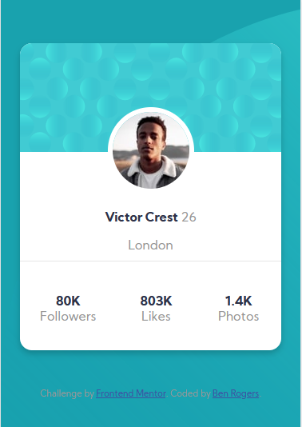

# Frontend Mentor - Profile card component solution

This is a solution to the [3-column preview card component challenge on Frontend Mentor](https://www.frontendmentor.io/challenges/profile-card-component-cfArpWshJ). Frontend Mentor challenges help you improve your coding skills by building realistic projects.

## Table of contents

- [Overview](#overview)
  - [The challenge](#the-challenge)
  - [Screenshot](#screenshot)
  - [Links](#links)
- [My process](#my-process)
  - [Built with](#built-with)
  - [Continued development](#continued-development)
- [Author](#author)

## Overview

### The challenge

Users should be able to:

- View the optimal layout depending on their device's screen size
- See hover states for interactive elements

### Screenshot

### Links

- Solution URL: [solution](https://github.com/benjamin0204/FrontEndMentorProjects/tree/main/profile-card-component-main)
- Live Site URL: [live site](https://portfolio-projects-frontendmentor-profile-card-component.netlify.app/)

## My process

### Built with

- Semantic HTML5 markup
- CSS custom properties
- Flexbox

### Continued development

I'd say this is a pretty coplete component. If anyone has anything i could do to improve it (within the scope of the challenge) please let me know.

## Author

- Website - [Ben Rogers | c[\_]](https://www.benrogers.uk)
- Frontend Mentor - [@benjamin0204](https://www.frontendmentor.io/profile/benjamin0204)
- github - [@benjamin0204](https://github.com/benjamin0204/FrontEndMentorProjects)

<!-- ## Acknowledgments

This is where you can give a hat tip to anyone who helped you out on this project. Perhaps you worked in a team or got some inspiration from someone else's solution. This is the perfect place to give them some credit.

**Note: Delete this note and edit this section's content as necessary. If you completed this challenge by yourself, feel free to delete this section entirely.** -->
