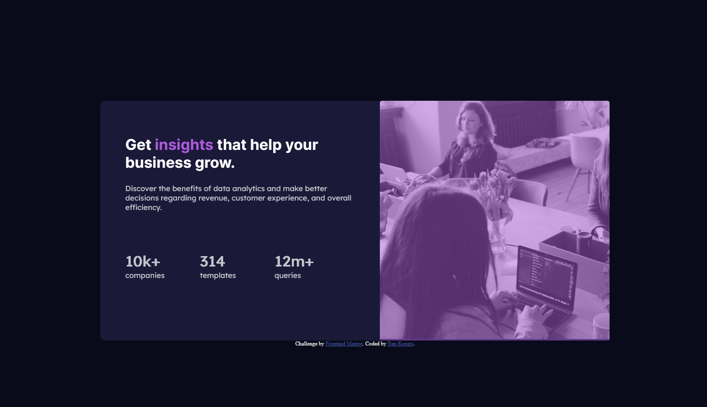
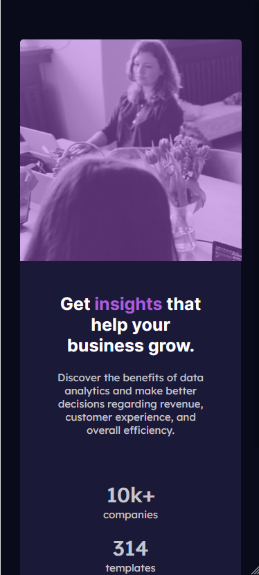

# Frontend Mentor - Stats preview card component solution

This is a solution to the [Stats preview card component challenge on Frontend Mentor](https://www.frontendmentor.io/challenges/stats-preview-card-component-8JqbgoU62). Frontend Mentor challenges help you improve your coding skills by building realistic projects.

## Table of contents

- [Overview](#overview)
  - [The challenge](#the-challenge)
  - [Screenshot](#screenshot)
  - [Links](#links)
- [My process](#my-process)
  - [Built with](#built-with)
  - [What I learned](#what-i-learned)
  - [Continued development](#continued-development)
  - [Useful resources](#useful-resources)
- [Author](#author)
- [Acknowledgments](#acknowledgments)

## Overview

### The challenge

Users should be able to:

- View the optimal layout depending on their device's screen size

### Screenshot





### Links

- Solution URL: [solution URL](https://github.com/benjamin0204/FrontEndMentorProjects/tree/main/stats-preview-card-component-main)
- Live Site URL: [live site URL](https://portfolio-project-frontendmentor-statpreviewcardcomponent.netlify.app/)

## My process

### Built with

- Semantic HTML5 markup
- CSS custom properties
- Flexbox
- CSS Grid
- Mobile-first workflow

### What I learned

I learned how to use flex to build a 2 column grid

```css
flex: 50%;
```

I also learnt how to overlay an image with a colour using an border (this is a bit scummy tbh) I initally used a background image css prop but found it difficult to code in the mobile version

#### inital overlay code

```css
.right {
  flex: 50%;
  overflow: hidden;
  background-image: linear-gradient(
      var(--color-primary-soft),
      var(--color-primary-soft)
    ), url(./images/image-header-desktop.jpg);
  background-blend-mode: overlay;
  background-size: cover;
}
```

#### final overlay code

```css
.right {
  flex-shrink: 0;
  flex: 50%;
  overflow: hidden;

  border-radius: 5px 5px 0px 0px;

  /* Colour over the image */
  outline: 300px solid hsla(277, 64%, 61%, 0.5) !important;
  outline-offset: -300px;

  background-blend-mode: overlay;
  background-size: cover;
}
```

### Continued development

I want to be able to remove all the unsavoury 'hacks' I've used in this task. I need to learn more about flexbox and how to push an image up when in mobile 'mode'

### Useful resources

- [Mdn background-image](https://developer.mozilla.org/en-US/docs/Web/CSS/background-image) - this helped me with the syntax for the background image

- [Medium, css variabls](https://electerious.medium.com/the-power-of-css-variables-6c4e4ebaf279) - this helped me with learning the syntax of css custom properties (I've used sass for this in the past)

- [W3School, flexbox guide](https://www.w3schools.com/css/css3_flexbox_responsive.asp) - Simple beginner friendly flex guide

- [W3School, border-radius](https://www.w3schools.com/cssref/css3_pr_border-radius.asp) - Syntax for border-radius (to omit the bottom changes)

- [Stackoverflow - elixon](https://stackoverflow.com/questions/18815157/how-to-overlay-image-with-color-in-css) - This is the solution i used for the colour overlay

```css
.red {
  outline: 100px solid rgba(255, 0, 0, 0.5) !important;
  outline-offset: -100px;
  overflow: hidden;
  position: relative;
  height: 200px;
  width: 200px;
}
```

```html
<div class="red">Anything can be red.</div>
<h1>Or even image...</h1>

```

## Author

- Website - [Ben Rogers | c[\_]](https://www.benrogers.uk)
- Frontend Mentor - [@benjamin0204](https://www.frontendmentor.io/profile/benjamin0204)
- github - [@benjamin0204](https://github.com/benjamin0204/FrontEndMentorProjects/tree/main/stats-preview-card-component-main)

<!-- ## Acknowledgments

This is where you can give a hat tip to anyone who helped you out on this project. Perhaps you worked in a team or got some inspiration from someone else's solution. This is the perfect place to give them some credit.

**Note: Delete this note and edit this section's content as necessary. If you completed this challenge by yourself, feel free to delete this section entirely.** -->
